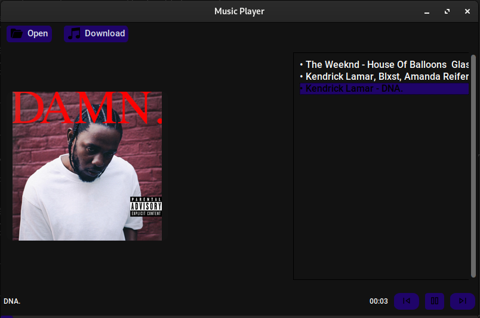

# How to install

*    `git clone https://github.com/Code-Theft-Auto/yami.git`

*    `cd yami`

*    `python -m venv .venv`

*    `source .venv/bin/activate` (linux/macos)

* `pip install -r requirements.txt`

* `python run.py`

## Screenshot

